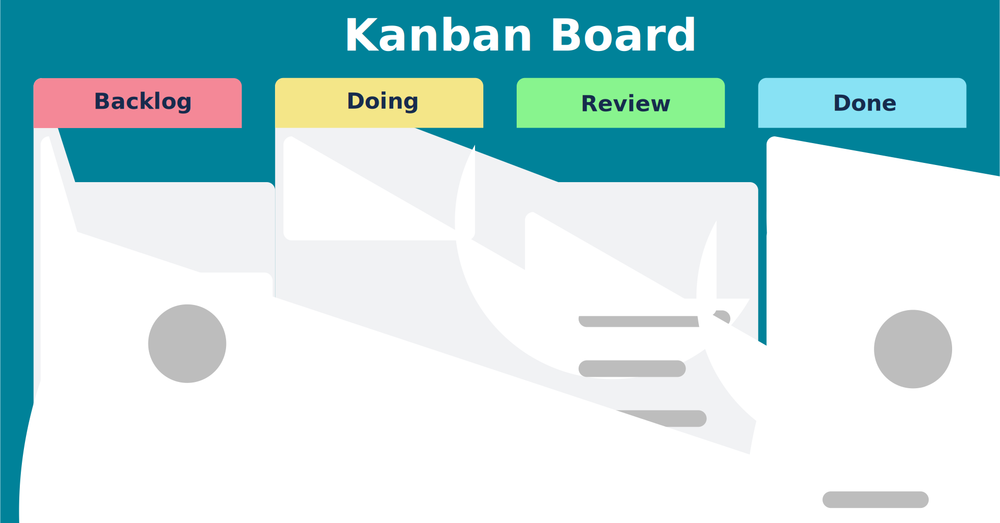

# 🧱 Fysiofresh Kanban Board



A simple **Kanban Board** application built with **Vue 3**, **Vuetify**, and the **Composition API**.  
This project was developed as part of a technical assignment for the **Software Developer position at Fysiofresh**.

## 🌐 Live Demo

**[View Live Application →](https://fysiofresh-seven.vercel.app/)**

The application is deployed on Vercel and fully functional with client-side state management.

---

## 🚀 Project Overview

This project demonstrates a lightweight Kanban task management board with basic CRUD operations and drag-and-drop functionality.  
It showcases front-end architecture, component-based design, and adherence to SOLID principles.

---

## 🧩 Tech Stack

- **Vue 3**
- **Vuetify**
- **Composition API**
- **Vite** (build tool)
- **TypeScript** (optional, used where beneficial)
- **Vitest** (for unit testing)
- **Hosted on:** GitHub Pages / Vercel

---

## ⚙️ Features

- 📋 **Kanban Board** with 4 status columns:
  - **Backlog** (pink)
  - **Doing** (yellow)
  - **Review** (green)
  - **Done** (blue)

- 🎯 **Task Cards** with:
  - Title  
  - Description
  - Quick action buttons (Edit & Delete)

- 🧠 **Drag & Drop:** Move cards between columns easily with visual feedback

- ✏️ **CRUD Operations:**
  - Create new tasks with dialog form
  - Edit existing tasks
  - Delete tasks with confirmation
  - Move tasks between statuses

- 🎨 **Modern UI:**
  - Color-coded column headers
  - Responsive grid layout (4 columns on desktop, stacked on mobile)
  - Smooth animations and hover effects
  - Toast notifications for user feedback

- 🧪 **Comprehensive Testing:**
  - 40 passing unit tests
  - Component, integration, and store tests

---

## 🧠 Architecture & Design Principles

- Designed following **SOLID** principles:
  - **S**ingle Responsibility: Each component handles one logical concern.
  - **O**pen/Closed: Components are easily extendable via props and slots.
  - **L**iskov Substitution: Interface-consistent components for reusability.
  - **I**nterface Segregation: Minimal component APIs.
  - **D**ependency Inversion: Separation of logic and presentation.

---

## 🧪 Testing

Comprehensive unit tests are implemented using **Vitest** for:
- Component rendering and interactions
- Event emission and prop handling
- State management logic (CRUD operations)
- Drag & drop functionality
- Form validations

**Test Coverage:** 40 passing tests across 6 test suites

Run tests locally:

```bash
npm run test
```

Run tests with UI:

```bash
npm run test:ui
```

---

## 🛠️ Development Setup

### Prerequisites
- Node.js `^20.19.0 || >=22.12.0`
- npm or yarn

### Installation

1. Clone the repository:
```bash
git clone https://github.com/yourusername/fysiofresh.git
cd fysiofresh
```

2. Install dependencies:
```bash
npm install
```

3. Start development server:
```bash
npm run dev
```

4. Build for production:
```bash
npm run build
```

5. Preview production build:
```bash
npm run preview
```

6. Run type checking:
```bash
npm run type-check
```

---

## 🚀 Deployment

The application is deployed on **Vercel** for easy hosting and automatic deployments.

### Deployment Steps:

1. **Build the project:**
   ```bash
   npm run build
   ```
   This creates an optimized production build in the `dist/` directory.

2. **Deploy to Vercel:**
   - Connect your GitHub repository to Vercel
   - Vercel automatically detects Vite configuration
   - Every push to main branch triggers automatic deployment

3. **Manual deployment (if needed):**
   ```bash
   vercel --prod
   ```

### Live Application

✅ **Production URL:** [https://fysiofresh-seven.vercel.app/](https://fysiofresh-seven.vercel.app/)

**Features:**
- Client-side only (no backend required)
- Fast global CDN delivery
- Automatic HTTPS
- Instant cache invalidation

---

## 📄 Appendix: `/tasks` API Contract

This section outlines a proposed RESTful API contract for backend integration. The API follows REST conventions and includes error handling for common failure scenarios.

### Base URL
```
https://api.fysiofresh.com/v1
```

### OpenAPI Schema (Draft)

#### Task Object
```yaml
Task:
  type: object
  required:
    - id
    - title
    - description
    - status
  properties:
    id:
      type: string
      format: uuid
      description: Unique identifier for the task
      example: "550e8400-e29b-41d4-a716-446655440000"
    title:
      type: string
      minLength: 1
      maxLength: 200
      description: Task title
      example: "Implement user authentication"
    description:
      type: string
      maxLength: 2000
      description: Detailed task description
      example: "Add JWT-based authentication with refresh tokens"
    status:
      type: string
      enum: ["backlog", "doing", "review", "done"]
      description: Current task status
      example: "backlog"
    createdAt:
      type: string
      format: date-time
      description: ISO 8601 timestamp of task creation
      example: "2025-01-15T10:30:00Z"
    updatedAt:
      type: string
      format: date-time
      description: ISO 8601 timestamp of last update
      example: "2025-01-15T14:25:00Z"
```

---

### Endpoints

#### 1. **GET /tasks**
Retrieve all tasks.

**Query Parameters:**
- `status` (optional): Filter by status (`todo`, `in-progress`, `done`)
- `limit` (optional): Maximum number of results (default: 100)
- `offset` (optional): Pagination offset (default: 0)

**Response: 200 OK**
```json
{
  "data": [
    {
      "id": "550e8400-e29b-41d4-a716-446655440000",
      "title": "Implement user authentication",
      "description": "Add JWT-based authentication with refresh tokens",
      "status": "backlog",
      "createdAt": "2025-01-15T10:30:00Z",
      "updatedAt": "2025-01-15T10:30:00Z"
    }
  ],
  "meta": {
    "total": 1,
    "limit": 100,
    "offset": 0
  }
}
```

**Error Response: 422 Unprocessable Entity**
```json
{
  "error": {
    "code": "INVALID_STATUS",
    "message": "Invalid status filter. Allowed values: backlog, doing, review, done",
    "details": {
      "field": "status",
      "value": "completed"
    }
  }
}
```

---

#### 2. **POST /tasks**
Create a new task.

**Request Body:**
```json
{
  "title": "Implement user authentication",
  "description": "Add JWT-based authentication with refresh tokens",
  "status": "backlog"
}
```

**Response: 201 Created**
```json
{
  "data": {
    "id": "550e8400-e29b-41d4-a716-446655440000",
    "title": "Implement user authentication",
    "description": "Add JWT-based authentication with refresh tokens",
    "status": "backlog",
    "createdAt": "2025-01-15T10:30:00Z",
    "updatedAt": "2025-01-15T10:30:00Z"
  }
}
```

**Error Response: 400 Bad Request**
```json
{
  "error": {
    "code": "MISSING_REQUIRED_FIELD",
    "message": "Title is required and cannot be empty",
    "details": {
      "field": "title",
      "constraint": "required"
    }
  }
}
```

**Error Response: 422 Unprocessable Entity**
```json
{
  "error": {
    "code": "INVALID_STATUS",
    "message": "Status must be one of: backlog, doing, review, done",
    "details": {
      "field": "status",
      "value": "completed",
      "allowedValues": ["backlog", "doing", "done"]
    }
  }
}
```

---

#### 3. **PATCH /tasks/{id}**
Update an existing task (partial update).

**Path Parameters:**
- `id` (required): Task UUID

**Request Body:**
```json
{
  "status": "doing"
}
```

**Response: 200 OK**
```json
{
  "data": {
    "id": "550e8400-e29b-41d4-a716-446655440000",
    "title": "Implement user authentication",
    "description": "Add JWT-based authentication with refresh tokens",
    "status": "doing",
    "createdAt": "2025-01-15T10:30:00Z",
    "updatedAt": "2025-01-15T14:25:00Z"
  }
}
```

**Error Response: 404 Not Found**
```json
{
  "error": {
    "code": "TASK_NOT_FOUND",
    "message": "Task with ID '550e8400-e29b-41d4-a716-446655440000' does not exist",
    "details": {
      "resource": "task",
      "id": "550e8400-e29b-41d4-a716-446655440000"
    }
  }
}
```

**Error Response: 422 Unprocessable Entity**
```json
{
  "error": {
    "code": "INVALID_STATUS",
    "message": "Status must be one of: backlog, doing, review, done",
    "details": {
      "field": "status",
      "value": "archived",
      "allowedValues": ["backlog", "doing", "done"]
    }
  }
}
```

---

#### 4. **DELETE /tasks/{id}**
Delete a task.

**Path Parameters:**
- `id` (required): Task UUID

**Response: 204 No Content**

**Error Response: 404 Not Found**
```json
{
  "error": {
    "code": "TASK_NOT_FOUND",
    "message": "Task with ID '550e8400-e29b-41d4-a716-446655440000' does not exist",
    "details": {
      "resource": "task",
      "id": "550e8400-e29b-41d4-a716-446655440000"
    }
  }
}
```

---

### Error Handling Summary

| Status Code | Error Code | Scenario | Example |
|-------------|------------|----------|----------|
| 400 | `MISSING_REQUIRED_FIELD` | Required field is missing | `title` not provided in POST |
| 400 | `INVALID_FORMAT` | Field format is invalid | `id` is not a valid UUID |
| 404 | `TASK_NOT_FOUND` | Task does not exist | PATCH/DELETE non-existent task |
| 422 | `INVALID_STATUS` | Status value not allowed | `status: "completed"` |
| 422 | `VALIDATION_ERROR` | Field validation failed | `title` exceeds 200 characters |
| 500 | `INTERNAL_SERVER_ERROR` | Unexpected server error | Database connection failure |

---

### Validation Rules

1. **Title**:
   - Required (cannot be empty or null)
   - Minimum length: 1 character
   - Maximum length: 200 characters

2. **Description**:
   - Optional
   - Maximum length: 2000 characters

3. **Status**:
   - Required on creation
   - Must be one of: `"backlog"`, `"doing"`, `"done"`
   - Case-sensitive

4. **ID**:
   - Auto-generated UUID v4 on creation
   - Immutable after creation

---

### Design Considerations

- **RESTful conventions**: Standard HTTP methods and status codes
- **Partial updates**: PATCH allows updating specific fields without sending the entire object
- **Error consistency**: Structured error responses with codes, messages, and actionable details
- **Validation first**: Client-side validation mirrors backend rules to minimize round trips
- **Idempotency**: DELETE returns 404 for non-existent resources (not 204)
- **Future extensibility**: Schema supports additional fields (e.g., `assignee`, `priority`, `dueDate`) without breaking changes
